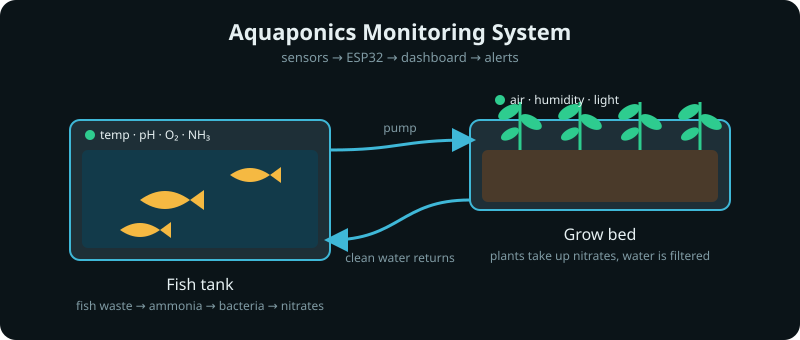
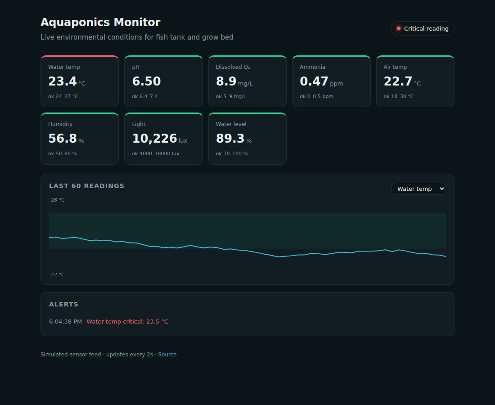

<div align="center">

# 🐟🌱 Aquaponics Monitoring System

A comprehensive monitoring system for aquaponics that tracks environmental conditions in real time to optimize plant growth and fish health.




<sub>Photo: Aquaponics at Growing Power, Milwaukee — Wikimedia Commons, CC BY-SA</sub>

</div>

## Dashboard



## What it does

Fish produce ammonia, bacteria turn it into nitrates, plants consume the nitrates and return clean water to the tank. That loop only works inside a narrow band of conditions, so this project watches the numbers that matter and raises an alert the moment one drifts.

| Metric | Sensor | Healthy range |
| --- | --- | --- |
| Water temperature | DS18B20 | 24 – 27 °C |
| pH | Analog pH probe | 6.4 – 7.4 |
| Dissolved oxygen | DO probe | 5 – 9 mg/L |
| Ammonia | NH₃ probe | 0 – 0.5 ppm |
| Air temperature & humidity | DHT22 | 18 – 30 °C · 50 – 80 % |
| Light | LDR | 4 000 – 18 000 lux |
| Water level | Float / ultrasonic | 70 – 100 % |

## How it works

```
sensors ──▶ ESP32 (firmware/) ──▶ JSON over Wi‑Fi ──▶ dashboard (index.html) ──▶ alerts
```

- **`firmware/aquaponics.ino`** reads the probes on an ESP32 and posts a JSON reading every 2 seconds.
- **`index.html` + `assets/`** is a dependency‑free dashboard: live metric cards, a 60‑point trend chart and an alert log. It ships with a simulated feed so it runs anywhere; swap `readSensors()` in `assets/app.js` for a `fetch()` to your board to go live.

## Run it

```bash
git clone https://github.com/ungaaaabungaaa/aquaponics-monitoring-system
cd aquaponics-monitoring-system
open index.html        # or: python3 -m http.server
```

No build step, no dependencies.

## License

MIT
